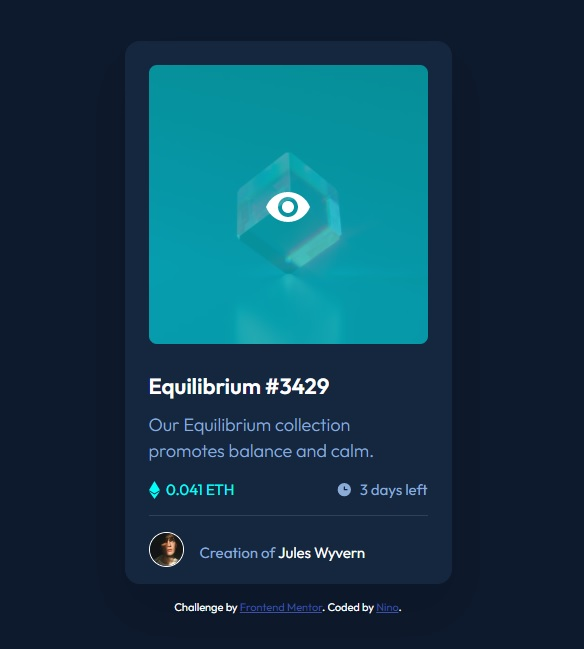

# Frontend Mentor - NFT preview card component solution

This is a solution to the [NFT preview card component challenge on Frontend Mentor](https://www.frontendmentor.io/challenges/nft-preview-card-component-SbdUL_w0U). Frontend Mentor challenges help you improve your coding skills by building realistic projects. 

## Table of contents

- [Overview](#overview)
  - [The challenge](#the-challenge)
  - [Screenshot](#screenshot)
  - [Links](#links)
- [My process](#my-process)
  - [Built with](#built-with)
  - [What I learned](#what-i-learned)
  - [Continued development](#continued-development)
  - [Useful resources](#useful-resources)
- [Author](#author)

## Overview

### The challenge

Users should be able to:

- View the optimal layout depending on their device's screen size
- See hover states for interactive elements

### Screenshot

### Links

- Solution URL: [GitHub Repository](https://github.com/ninogogol/NFT-preview-card-component-solution)
- Live Site URL: [GitHub Page](https://ninogogol.github.io/NFT-preview-card-component-solution/)

## My process

### Built with

- Semantic HTML5 markup
- CSS custom properties
- Flexbox
- Mobile-first workflow

### What I learned

I learned how to create a fading overlay effectto an image on hover:

### Continued development
I want to build more projects to improve my coding skills.

### Useful resources

- [w3schools](https://www.w3schools.com/howto/howto_css_image_overlay.asp) - This helped me to create image hover overlay.
## Author

- Linkedin - [Nino Gogoladze](https://www.linkedin.com/in/nino-gogoladze-80a075227/)

